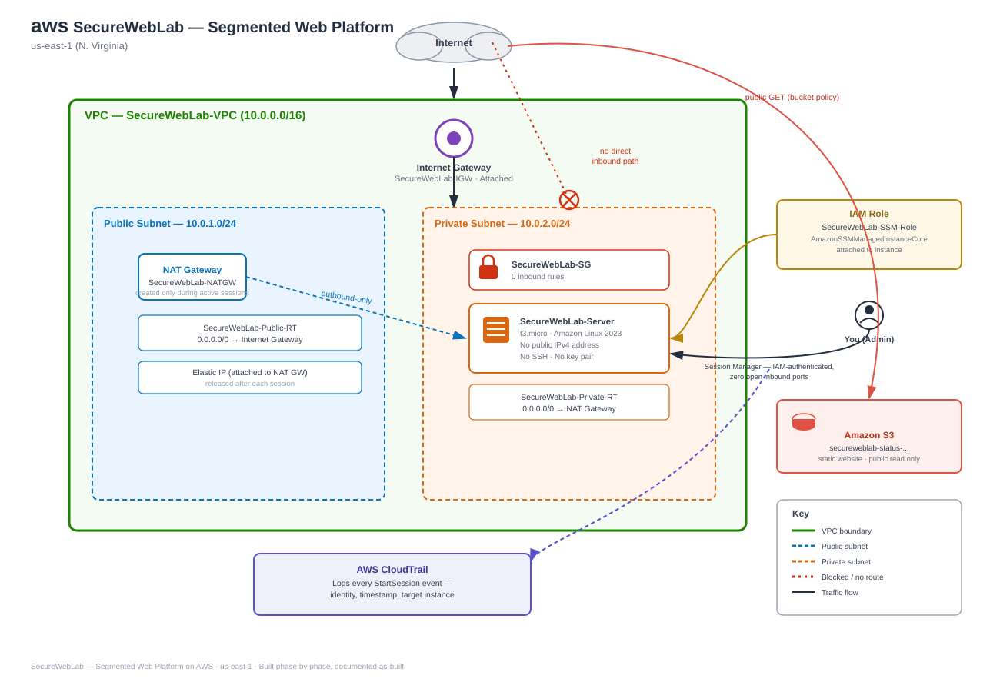

# SecureWebLab — Segmented Web Platform on AWS

A small, real AWS build: a public status website served from S3, and a private backend server that's reachable by nothing on the internet — no SSH, no open ports, no key file. The only way in is an IAM-authenticated AWS Systems Manager session, fully logged.

## What this demonstrates

- VPC design with public/private subnet segmentation
- Least-privilege IAM roles for resource-level (not user-level) access
- NAT Gateway outbound-only routing, with deliberate cost-lifecycle management
- SSH-free remote access via AWS Systems Manager Session Manager
- S3 static website hosting with a scoped public-read bucket policy
- Full access logging and verification via CloudTrail

## Stack

AWS VPC · EC2 · IAM · S3 · Systems Manager (Session Manager) · CloudTrail — built entirely through the AWS Console, region `us-east-1`

## Live demo

Public status page: `secureweblab-status-abdimalik123.s3-website-us-east-1.amazonaws.com` *(update with your actual endpoint)*

## Full write-up

Every phase, every decision, every issue hit and how it was resolved, with evidence screenshots: **[BUILD-LOG.md](BUILD-LOG.md)**

